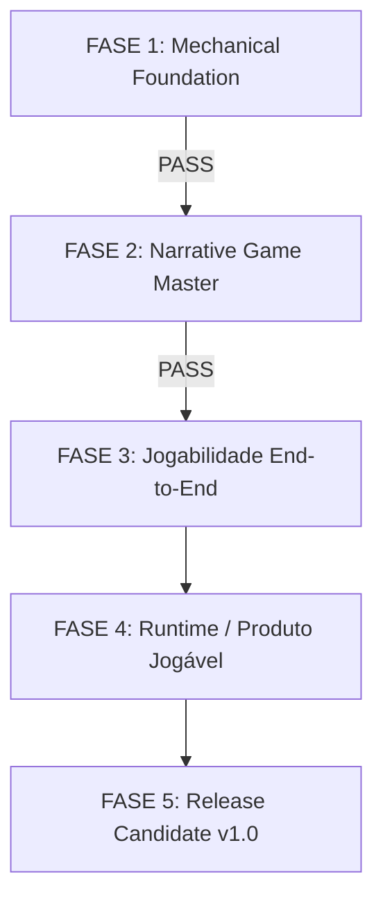

# Age of Shattered Oaths — Project Master Roadmap & Definition of Done

This document is the authoritative master roadmap and closure contract for the core architecture and development of **Age of Shattered Oaths**.

It establishes the exact path to completion, defines the formal Definition of Done, and governs milestone progression.

---

## 1. Official Definition of Done (v1.0 Release Contract)

The project is complete and ready for public/playable campaign release when:

> **The player can start a campaign, send natural-language inputs through the real game interface, receive coherent, visceral narrative responses from the AI, have valid actions executed and invalid/impossible actions rejected, advance weekly turns, alter the world state, interact with people and factions that remember past interactions, encounter and resolve delayed consequences, and persist/reload the campaign seamlessly — while every mechanical fact and numerical outcome is strictly determined by the deterministic Engine and recorded in the canonical ledgers, event stores, and state representations.**

---

## 2. Canonical Pipeline & Frozen Architecture

The pipeline of Age of Shattered Oaths is closed and frozen:

```text
PLAYER (UI)
   ↓  (Natural Language Input)
GeminiNarrativeLLM / MockNarrativeLLM (Action Classifier / Interpreter)
   ↓  (NarrativeCommand)
RuleResolver / GenericResolution / Codex
   ↓  (RuleResolutionResult)
ENGINE (Deterministic Simulation, Calendar, Mechanics, Ledgers)
   ↓  (ExecutionReport + Updated CampaignState)
ObserverProjection (Fog of War & Isolation Boundary)
   ↓  (NarrativeContext)
GeminiNarrativeLLM / MockNarrativeLLM (Sensory Translation Layer)
   ↓  (Raw Prose)
SemanticValidation (Hallucination, Agency & Boundary Filter)
   ↓  (Final Prose in Iron Chronicle Style)
PLAYER (UI)
```

### Core Architecture Rules:
1. **The LLM is NOT a mechanical authority:** The Engine is the sole arbiter of facts, numbers, and outcomes.
2. **Absolute Mechanical Silence:** Narration translates mechanical changes into physical and sensory impacts without exposing raw numbers, DCs, or RPG abbreviations.
3. **No Parallel Subsystems:** No new "AI Brains", "Quest Directors", "Story Managers", or secondary time/event/memory trackers may be created.

---

## 3. Development Phases & Current Status

The remaining development is structured into **5 definitive phases**. No additional milestones or intermediate architectural gates may be introduced outside this roadmap without an objective P0/P1 defect or an explicit scope change.



---

### FASE 1 — Mechanical Foundation

* **Objective:** Ensure the deterministic simulation world functions reliably, accurately, and deterministically.
* **Scope:**
  - Deterministic Engine core (`src/engine.ts`).
  - Canonical calendar ($12\text{ months} \times 4\text{ weeks} = 48\text{ weeks/year}$).
  - Resources, treasury accumulation, labor pool, food, materials, production, and military upkeep.
  - Codex & RuleResolver authority.
  - Generic Resolution system (MRS & Contextual Generic Actions).
  - Temporal dynamics: `Relationship`, `Vows`, `MemoryLog`, `VisibilityService`, `EventStore`.
  - Long-term simulation (520 weeks / 10 years) and 100% bit-for-bit replay determinism.
* **Status:** **PASS / CONCLUÍDA**
* **Governance:** Closed. No new mechanical systems or refactors unless an objective P0 defect is discovered.

---

### FASE 2 — Narrative Game Master

* **Objective:** Ensure the AI sensory translation layer interacts faithfully with the Engine, respects player agency, preserves knowledge boundaries, and operates as an Iron Chronicle Game Master.
* **Scope:**
  - Intent interpretation & classification (`actionClassifier.ts`, `semanticInputContract.ts`).
  - Strict execution reporting without state leakage (`executionReport.ts`, `narrativeProjection.ts`).
  - Deterministic semantic validation against hallucinations and stat invention (`semanticValidation.ts`).
  - Calibration across diverse behaviors: strategy changes, NPC revisits, recovery arcs, resource scarcity, seasonal transitions, repeated actions, periods of inactivity, and exploit resistance (M13 & M14 Gates 1–3.1).
* **Status:** **PASS / CONCLUÍDA**
* **Governance:** Closed. The GM sensory translation pipeline is validated across 160+ action emergent campaigns and continuous 30-action valid chains with 0 semantic violations.

---

### FASE 3 — Jogabilidade End-to-End

* **Objective:** Validate that a human player can experience a complete, coherent, multi-turn RPG campaign loop end-to-end without needing to understand the underlying engine abstractions or code structures.
* **Target Acceptance Flow:**
  1. Initialize campaign with starting noble house and region.
  2. Receive opening environmental/sensory scene.
  3. Engage in diplomatic/conversational exchange with a noble NPC.
  4. Make an active strategic decision (recruitment, construction, or trade).
  5. Receive sensory feedback and advance weekly turns.
  6. Observe world evolution and seasonal change.
  7. Return to the previously contacted NPC and observe persistent social memory.
  8. Shift strategy abruptly (e.g. from diplomacy to defensive fortification or expedition).
  9. Encounter a delayed consequence generated by a past action.
  10. Resolve the consequence and continue the campaign.
  11. Save campaign snapshot to persistent storage.
  12. Reload campaign snapshot and resume play with full continuity.
* **Exit Criteria:** A complete campaign session can be played from start to finish via the authoritative pipeline, demonstrating organic gameplay flow and persistent state.
* **Status:** **PASS / CONCLUÍDA**
* **Validation:** Verified via [tests/e2e/CampaignPlayabilityE2E.test.ts](file:///c:/Projetos/Age_Of_Shattered_Oats/tests/e2e/CampaignPlayabilityE2E.test.ts) covering F3.1 (Player Input E2E), F3.2 (Continuous Multi-Week Campaign E2E), and F3.3 (Save/Reload Persistence E2E).

---

### FASE 4 — Runtime / Produto Jogável

* **Objective:** Validate the integration between the frontend user interface, backend server, real Gemini API integration, offline fallback resilience, and persistence lifecycle.
* **Target Criteria:**
  - Dev server (`npm run dev`) and production server (`npm start`) start cleanly.
  - Web UI sends player input to `/api/` endpoints and receives structured narrative + ledger state.
  - Real Gemini API (`GeminiNarrativeLLM`) generates immersive prose within latency constraints.
  - Offline fallback (`MockNarrativeLLM`) activates gracefully if API key is missing or network fails.
  - API timeouts or network errors never corrupt the in-memory or persisted `CampaignState`.
  - Save/Load mechanism reliably serializes and restores complete campaign state from disk/browser.
* **Exit Criteria:** A non-technical user can open the browser, play an uninterrupted multi-week campaign, close the browser, return later, and resume seamlessly.
* **Status:** **PASS / CONCLUÍDA**
* **Validation:** Verified via [tests/runtime/RuntimePlayabilityIntegration.test.ts](file:///c:/Projetos/Age_Of_Shattered_Oats/tests/runtime/RuntimePlayabilityIntegration.test.ts) covering endpoint integration, Gemini/Mock fallback switching, timeout resilience, continuous play session, and save/reload state continuity.

---

### FASE 5 — Release Candidate (v1.0)

* **Objective:** Final verification, stabilization, quality gate approval, and release packaging.
* **Criteria:**
  1. **Quality Gate:**
     - `npm run lint` passes with 0 errors.
     - `npx tsc --noEmit` passes with 0 errors.
     - `npm test` passes 100% of all test suites (43+ suites).
     - `npm run build` generates production bundle cleanly.
  2. **Security:** Aikido scan logged as external pending (MCP unavailable in current local environment).
  3. **Replay Validation:** Bit-for-bit replay validator passes.
  4. **Smoke Test:** Complete manual/automated end-to-end gameplay session passes without glitches.
  5. **Technical Debt Triage:**
     - Zero P0, P1, or P2 defects open.
     - `DEBT-001` (P3) remains deferred to future post-release secular simulation updates.
* **Status:** **PASS / v1.0 RELEASE CANDIDATE**
* **Validation:** Verified via the comprehensive Release Candidate Audit covering starting state, authoritative gameplay loop, mechanical truth, continuity, Iron Chronicle narrative, Gemini/Mock fallback switching, persistence, and deterministic replay.

---

## 4. Release Acceptance Checklist

| Area | Requirement | Status |
| :--- | :--- | :--- |
| **Mechanics** | Deterministic Engine execution for all actions | `PASS` |
| **Mechanics** | Single canonical campaign calendar ($48\text{ weeks/year}$) | `PASS` |
| **Mechanics** | Replay reproducibility bit-for-bit | `PASS` |
| **Narrative** | Natural language intent classification | `PASS` |
| **Narrative** | Absolute mechanical silence (no raw numbers in prose) | `PASS` |
| **Narrative** | Zero hallucinated casualties, resources, or mechanics | `PASS` |
| **Narrative** | Preservation of player agency | `PASS` |
| **Campaign** | Multi-turn persistent state evolution | `PASS` |
| **Campaign** | NPC relationship and memory decay continuity | `PASS` |
| **Campaign** | Delayed consequences triggering on exact turns | `PASS` |
| **Campaign** | End-to-end gameplay flow across seasons | `PASS` |
| **Runtime** | Web UI $\leftrightarrow$ Server $\leftrightarrow$ LLM $\leftrightarrow$ Engine integration | `PASS` |
| **Runtime** | Real Gemini API + graceful offline fallback | `PASS` |
| **Runtime** | Save / Load state persistence | `PASS` |
| **Quality** | Full test suite (43/43), TypeScript, lint, and build passing | `PASS` |

---

## 5. Post-Release Governance

With the approval of **v1.0 Release Candidate**, the foundational architecture of Age of Shattered Oaths is officially **FROZEN**.

* **No New Milestones or Architectural Overhauls:** The core 5-Phase development roadmap is concluded.
* **Maintenance & Content Scope Only:** Future development will focus strictly on:
  1. Bug fixes for verified P0/P1 issues.
  2. Numerical balance adjustments.
  3. Content additions (new Codex lore, event tables, noble houses).
  4. UI/UX styling and accessibility enhancements.
  5. Performance and long-term simulation optimizations (e.g. `DEBT-001`).


---

## 5. Post-Release Governance (Beyond v1.0)

Once the Phase 5 Release Candidate is approved, development transitions from **Core Architecture** to **Content & Product Operations**:

* Bug fixes & balance adjustments.
* Content expansion (new noble houses, events, Codex lore nodes, regions).
* UI/UX polish and visual asset enrichment.
* Additional mechanical domains (if explicitly specified).
* Performance optimizations (such as `DEBT-001` event pruning for multi-century campaigns).

**No new architectural gates or parallel subsystems may be added.**
