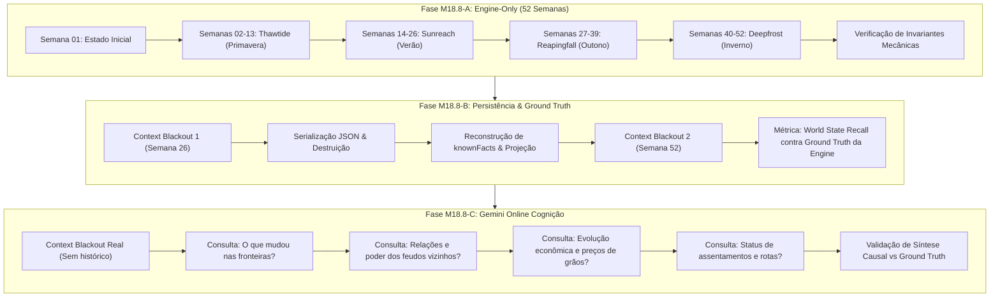

# ESPECIFICAÇÃO E AUDITORIA DE CAPACIDADE: M18.8 — LIVING WORLD & WORLD STATE EVOLUTION

**Data**: 2026-08-23  
**Marco**: M18.8 (World State Evolution / Living World Playtest)  
**Objetivo**: Auditar os mecanismos de simulação do mundo vivo na Engine, estabelecer a matriz de capacidades reais e estruturar o plano de testes longitudinais de 52 semanas em 3 fases (Engine-only, Persistência Multilateral e Gemini Online).

---

## 1. Matriz de Capacidade do Mundo Vivo (Living World Audit)

Para evitar que testes pressuponham mecânicas inexistentes ou confundam lacunas de simulação com falhas de IA/persistência, esta auditoria cataloga o suporte real da arquitetura atual:

| Domínio de Simulação | Status de Suporte | Mecanismo Canônico Existente na Engine | Escopo de Validação no M18.8 |
|---|:---:|---|---|
| **`REGIONAL_ECONOMY`** | `SUPPORTED` | `MarketService` (demanda regional, 12 meses/4 estações, saturação), `FoodService` (consumo semanal, colheita, `famineTicks`), `ProductionService` (rendimentos de minas/campos) | Variação de preços de trigo e ferro ao longo de 4 estações; ciclos de abundância e escassez. |
| **`DIPLOMATIC_EVOLUTION`** | `SUPPORTED` | `Relationship`, `worldLedger.nobleHouses` (`opinion`, `status`, `allies`, `enemies`), `checkVowsExpired(absoluteTurn)`, tratados em `majorEvents` | Evolução de neutralidade para aliança, expiração de trégua, tensão e ruptura com registro causal. |
| **`FRONTIER_CONTROL_CHANGE`** | `SUPPORTED` | `worldLedger.majorEvents`, `sessionLog.pendingConsequences`, guarnições e memórias causais | Mudança de comando e postura da Velha Ponte (guarnição sem brasão -> trégua -> bloqueio hostil). |
| **`CHARACTER_LIFECYCLE`** | `SUPPORTED` | `getAbsoluteCampaignTurn()`, virada anual de idade, decaimento de memória em `MemoryLog.evaluateDecay()`, acumulação de `nicknames` | Envelhecimento, registro de títulos/alcunhas e retenção seletiva por importância de memória. |
| **`LEADER_SUCCESSION`** | `PARTIALLY_SUPPORTED` | `SuccessionService.getSuccessionOrder(relatives)` (herdeiros legítimos, primogenitura, colaterais); mutação em `nobleHouses[i].currentLord` | Substituição formal de governante de Casa Nobre por herdeiro legítimo durante a campanha. |
| **`SETTLEMENT_STATUS`** | `PARTIALLY_SUPPORTED` | `holdings.population`, `holdings.laborPool`, `Village.status` (`Protectorate`, `Embargoed`, `Burnt`, `Independent`), `Outpost` | Crescimento/declínio de assentamento e alteração de status protetorado/independente. |
| **`TRADE_ROUTE_EVOLUTION`** | `SUPPORTED` | `MarketService` (rotas do leste, estepes, snowlands), `sessionLog.pendingConsequences`, interrupções de rotas | Bloqueio de rota fluvial e desvio de comércio de grãos por compras ou contrabandistas. |
| **`POPULATION_MIGRATION`** | `PARTIALLY_SUPPORTED` | `LaborService`, `PayrollService.resolveDesertion()`, efeitos de `famineTicks` no contingente civil e militar | Queda de mão de obra por escassez contínua e recrutamento de guarnição. |

---

## 2. Estrutura de Execução do M18.8 em 3 Fases



---

## 3. Roteiro da Campanha Anual (52 Semanas Mecânicas)

### Trimestre 1 (Semanas 1 a 13 - Thawtide / Primavera):
- **Economia**: Preço de grãos moderado em *Central Plains*; comércio fluvial do leste aberto.
- **Fronteira**: Velha Ponte ocupada por 25 soldados sem brasão; comandante desconhecido.
- **Geopolítica**: Casa Ironhand neutra (Opinião: 0); Lorde Decimus governa Ironhold.
- **Obras**: Fundação da paliçada defensiva em Raven's Watch.

### Trimestre 2 (Semanas 14 a 26 - Sunreach / Verão):
- **Diplomacia & Fronteira**: Tobin firma trégua formal de passagem (S22) com o comandante na ponte; boatos apontam oficial de Ironhand (S14); investigação no S18 comprova Capitão Vane.
- **Economia**: Compras anônimas volumosas elevam o preço dos grãos no leste (S26).
- **Context Blackout 1 (Semana 26)**: Serialização, descarte de memória, verificação de paridade.

### Trimestre 3 (Semanas 27 a 39 - Reapingfall / Outono):
- **Fronteira & Conflito**: Emboscada na ponte rompe a trégua na Semana 35; posto volta a ser hostil.
- **Geopolítica**: Morte de Lorde Decimus em Ironhold; sucessão formal assume o herdeiro Lorde Kenneth Ironhold via `SuccessionService`. Opinião cai para -1 (Tensa).
- **Assentamento & Rotas**: Posto avançado no desfiladeiro oriental sofre desabastecimento; rota secundária é ativada.

### Trimestre 4 (Semanas 40 a 52 - Deepfrost / Inverno):
- **Economia de Inverno**: Preço dos mantimentos atinge o ápice sazonal no inverno; consumo rigoroso de celeiros.
- **Demografia & Mão de Obra**: Mão de obra redistribuída para manutenção interna; obras congeladas pela neve.
- **Context Blackout 2 (Semana 52)**: Serialização final e fechamento do ciclo anual.

---

## 4. Métricas e Hard Gates do M18.8

```text
World State Recall (Ground Truth Match) = 100%
Temporal Epistemic Consistency          = 100%
Succession Continuity                   = 100%
Economic Seasonality Alignment          = 100%
False Emergence / Fabricated Events     = 0
Stale-State Leakage                     = 0
Context Dependence                      = 0
```

---

## 5. Próximos Passos
1. Implementar [`tests/LivingWorldEvolution.test.ts`](file:///c:/Projetos/Age_Of_Shattered_Oats/tests/LivingWorldEvolution.test.ts) cobrindo **Fase A (Engine-only)** e **Fase B (Persistência)**.
2. Executar o ciclo anual e validar todas as transições de estado contra o Ground Truth.
3. Executar **Fase C (Gemini Online)** sob Context Blackout Real com as 4 perguntas de síntese macroscópica.
