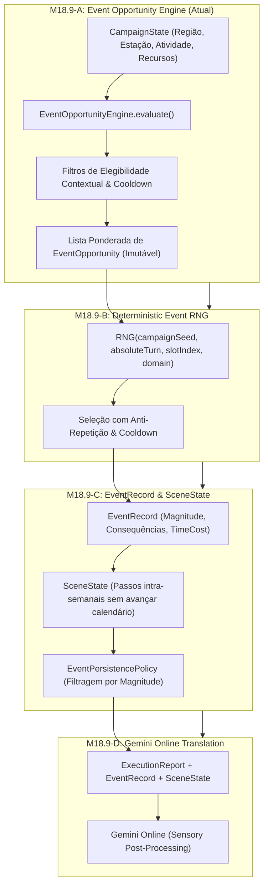

# ESPECIFICAÇÃO ARQUITETURAL: M18.9 — EMERGENT INCIDENT & DYNAMIC EVENT SYSTEM

**Data**: 2026-08-23  
**Marco**: M18.9 (Emergent Incident & Dynamic Event System)  
**Objetivo**: Introduzir um sistema determinístico de oportunidades contextuais e incidentes emergentes, permitindo granularidade temporal intra-semanal, profundidade de cena e enriquecimento sensorial sem violar o Mechanical Truth System.

---

## 1. Princípios de Arquitetura

1. **Separação Estrita de Responsabilidades**:
   - `EventOpportunityEngine` avalia o estado e determina *quais eventos são elegíveis* e seus pesos.
   - `DeterministicEventRNG` (M18.9-B) seleciona o evento usando seeds de campanha (`campaignSeed + turn + slot + domain`).
   - `EventRecord & SceneState` (M18.9-C) gerencia o impacto mecânico, custo temporal (`timeCost`) e continuidade de micro-cenas.
   - `GeminiNarrativeLLM` (M18.9-D) realiza estritamente a *tradução sensorial e atmosférica*, sem inventar mecânicas.
2. **Determinismo Absoluto**: Zero uso de `Math.random()` solto. Todo o pipeline é funcional e reproduzível.
3. **Imutabilidade no Opportunity Engine**: O avaliador de oportunidades não muta o `CampaignState` nem consome recursos.

---

## 2. Estrutura das 4 Fases do M18.9

---

## 3. Matriz de Magnitudes e Política de Persistência

| Magnitude | Categoria | Impacto Típico | Política de Persistência (`EventPersistencePolicy`) |
|---|---|---|---|
| **`INCIDENTAL`** | Atmosférico / Flavor | Nenhum impacto mecânico (ex: corvo pousa, vento uiva) | Efêmero (apenas narrativa, sem registro em memórias) |
| **`MINOR`** | Pequena Complicação | Custo de tempo leve, desgaste de ferramenta, dor leve | Log temporal da semana em `TurnResult.eventLog` |
| **`SIGNIFICANT`** | Oportunidade / Tático | Rastro suspeito, mercador raro, pequena avaria | Registrado em `character.memories` |
| **`MAJOR`** | Virada de Planejamento | Ruptura de acordo, morte de lorde, epidemia local | `worldLedger.majorEvents` + memórias + cadeia causal |
| **`CRITICAL`** | Crise Sistêmica | Guerra total, invasão maciça, cerco à fortaleza | Reconfiguração geopolítica e eventos encadeados |

---

## 4. Requisitos e Hard Gates do M18.9-A

1. **Elegibilidade Contextual**: Eventos de viagem só aparecem durante `TRAVEL`, acidentes de obra só durante `BUILD`, etc.
2. **Determinismo e Imutabilidade**: Duas chamadas com o mesmo `CampaignState` e contexto produzem 100% dos mesmos candidatos e pesos.
3. **Respeito a Cooldown**: Eventos ocorridos recentemente respeitam a janela de resfriamento.
4. **Isolamento de Recursos**: Madeira/pedra não convertem `TRADE` em `BUILD`.
5. **Zero Efeitos Colaterais**: O `CampaignState` não sofre mutação na avaliação de oportunidades.
