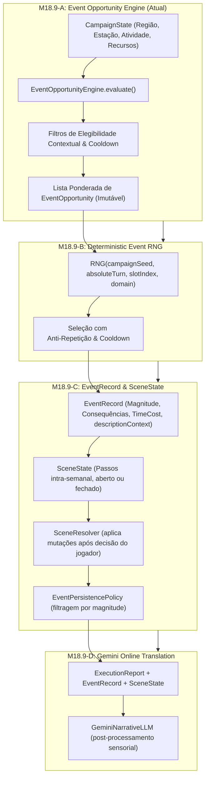

# ESPECIFICAÇÃO ARQUITETURAL: M18.9 — EMERGENT INCIDENTS & DYNAMIC EVENT SYSTEM

**Data**: 2026-08-23
**Marco**: M18.9 (Emergent Incident & Dynamic Event System)
**Objetivo**: Introduzir um sistema determinístico de oportunidades contextuais e incidentes emergentes, permitindo granularidade temporal intra‑semanal, profundidade de cena e enriquecimento sensorial sem violar o Mechanical Truth System.

---

## 1. Princípios de Arquitetura
1. **Separação Estrita de Responsabilidades**:
   - `EventOpportunityEngine` avalia o estado e determina *quais eventos são elegíveis* e seus pesos.
   - `DeterministicEventRNG` (M18.9‑B) seleciona o evento usando seeds de campanha (`campaignSeed + turn + slot + domain`).
   - `EventRecord` & `SceneState` (M18.9‑C) gerenciam o impacto mecânico, custo temporal (`timeCost`) e continuidade de micro‑cenas.
   - `GeminiNarrativeLLM` (M18.9‑D) realiza *apenas* a tradução sensorial, sem criar mecânicas.
2. **Determinismo Absoluto**: Zero uso de `Math.random()`. Todo o pipeline é funcional e reproduzível.
3. **Imutabilidade no Opportunity Engine**: O avaliador de oportunidades não muta o `CampaignState` nem consome recursos.

---

## 2. Fluxo de 4 Fases (M18.9‑A → D)

---

## 3. Contrato de `EventMutation`
```ts
export type EventMutation =
  | {
      kind: 'RESOURCE_GAIN' | 'RESOURCE_LOSS';
      resource: ResourceId;
      amount: number;
    }
  | {
      kind: 'INJURY_LIGHT' | 'INJURY_SEVERE';
      targetId: string;
    }
  | {
      kind: 'TRAVEL_DELAY';
      days: number;
    }
  | {
      kind: 'ACTIVITY_CHANGE';
      activity: Activity;
    }
  | {
      kind: 'DISCOVER_FACT';
      fact: AuthorizedKnowledgeFact;
    }
  | {
      kind: 'DIPLOMATIC_SHIFT';
      houseId: string;
      delta: number;
    }
  | {
      kind: 'CREATE_OPPORTUNITY';
      opportunityId: string;
    }
  | {
      kind: 'CREATE_CAUSAL_EVENT';
      eventId: string;
    };
```
> **Nota**: A união discriminada impede que payloads genéricos passem a compilação.

---

## 4. `descriptionContext` estruturado
```ts
export interface DescriptionContext {
  locationId: string;
  eventType: string;
  sensoryTags: readonly string[]; // ex.: ['smoke', 'distant clang']
  actorIds: readonly string[];   // IDs de personagens envolvidos
}
```
O `GeminiNarrativeLLM` recebe somente este objeto para gerar a narrativa.

---

## 5. Política de Magnitudes & Spam Narrativo
| Magnitude | Categoria | Impacto Típico | Política de Densidade |
|---|---|---|---|
| **`INCIDENTAL`** | Atmosférico / Flavor | Nenhum impacto mecânico | Pode ocorrer ocasionalmente; **não** abre cena, **não** gera mutações, `timeCost = NONE`, `requiresDecision = false` |
| **`MINOR`** | Pequena Complicação | Custo de tempo leve, desgaste de ferramenta, dor leve | Cooldown por categoria (ex.: 3 turnos). Abre cena opcionalmente (`requiresDecision = true`). |
| **`SIGNIFICANT`** | Oportunidade / Tático | Rastro suspeito, mercador raro, pequena avaria | Cooldown forte (ex.: 5 turnos). Sempre abre cena. |
| **`MAJOR`** | Virada de Planejamento | Ruptura de acordo, morte de lorde, epidemia local | Cooldown muito forte (ex.: 8 turnos). Uma única ocorrência por janela de 10 turnos. |
| **`CRITICAL`** | Crise Sistêmica | Guerra total, invasão maciça, cerco à fortaleza | Só ocorre quando condições de mundo justificam; máximo 1 por campanha. |

---

## 6. Fluxo de Evento Dinâmico (Camada Sobreposta)
```text
Comando → Resolução Normal → EventOpportunityEngine
    ├─ Não há oportunidade → Resultado normal
    └─ Oportunidade encontrada → RNG
        ├─ RNG não seleciona evento → Resultado normal
        └─ RNG seleciona → EventRecord
            ├─ Magnitude = INCIDENTAL → Narrativa automática, sem cena
            └─ Magnitude ≥ MINOR → Cria SceneState (aberta) → Jogador decide → SceneResolver gera EventMutation[] → Engine aplica
```
Esta camada **não substitui** o ciclo semanal; o calendário macro continua sendo a unidade de avanço.

---

## 7. Testes a Serem Implementados (especificação)
1. Nenhuma oportunidade → fluxo normal.
2. Oportunidade elegível mas RNG não seleciona → fluxo normal.
3. Evento `INCIDENTAL` sem cena, sem mutação, `timeCost = NONE`.
4. Evento `MINOR` abre cena, gera mutação após escolha.
5. Escolha do jogador produz consequências corretas.
6. Política de spam impede mais de X eventos por janela de turnos.
7. Save/Load de cena aberta preserva estado.
8. Cadeia causal entre eventos (ex.: CREATE_CAUSAL_EVENT).
9. Gemini nunca produz `EventMutation` – apenas narrativa.

---

## 8. Checklist Pós‑Edição
- [ ] Atualizar `docs/playtest/M18.9_EMERGENT_INCIDENTS_SPEC.md` conforme acima.
- [ ] Garantir que nenhum código‑fonte foi alterado ainda.
- [ ] Submeter o diff ao repositório para revisão antes da implementação C1‑C4.

---

*Esta revisão incorpora todas as correções arquiteturais solicitadas e prepara a base para a implementação dos módulos C1‑C4.*
